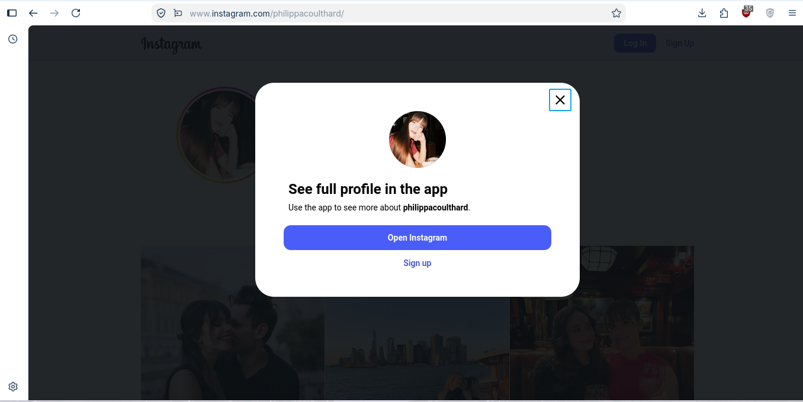
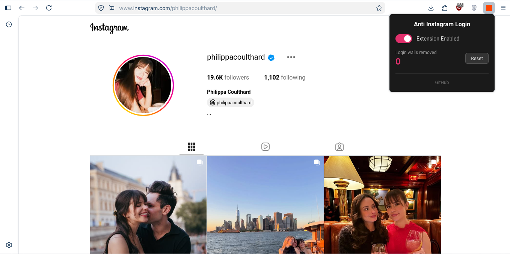

# Anti Instagram JS

A browser extension that removes Instagram's login wall so you can browse profiles and view posts without logging in.

## Showcase

| Without Extension | With Extension |
|:---:|:---:|
|  |  |

## What it does

- **Removes the login wall popup** — that "Sieh dir das vollständige Profil in der App an" dialog? Gone. Instantly.
- **Removes the dark backdrop** — gets rid of the dark overlay that blocks you from interacting with the page.
- **Removes invisible click interceptors** — Instagram places invisible full-screen divs over posts to intercept clicks and trigger the login wall. Removed.
- **Direct post navigation** — clicking a post navigates directly to the post URL instead of triggering Instagram's JS login wall.
- **Direct profile navigation** — clicking a profile name on a post page navigates directly instead of showing a login wall.
- **Unlocks scroll** — restores page scroll so you can browse the full profile.
- **Download media** — a floating download button appears on post and reel pages. Click it (or press **D**) to download photos (real JPG, re-encoded) or videos (as MP4 on Chrome/Edge, WebM on Firefox). For carousel posts, it downloads the currently visible image.
- **Carousel batch download** — Alt+click the download button to save every slide of a carousel as separate JPGs.
- **Stop video recording early** — click the button again while a video download is running to stop and save what's been captured so far.
- **Profile picture download** — on profile pages, double-click the avatar to download it in the best available resolution.
- **Download counter** — the popup tracks how many media files you've downloaded.
- **Exact timestamps** — relative times like "200 Wo." get a "~3.8y" suffix computed from the real date, a hover tooltip with the full exact date/time, and the post's own timestamp shows the exact upload date and time inline.
- **On/Off toggle** — turn the whole thing off with one click if you want Instagram's default behavior back.
- **Block counter** — keeps track of how many login walls have been bypassed. Reset it anytime.

## How to install (Chrome / Brave / Edge)

1. Download or clone this repo
2. Open `chrome://extensions/` (or `brave://extensions/` / `edge://extensions/`)
3. Turn on **Developer mode** (top right toggle)
4. Click **Load unpacked**
5. Pick the folder you downloaded
6. Go to any Instagram profile — the login wall is gone

## How to install (Firefox / LibreWolf)

https://addons.mozilla.org/en-US/firefox/addon/anti-instagram-js/

Firefox doesn't support MV3 background service workers, so it needs its own manifest — the build script handles that for you:

1. Download or clone this repo
2. Run `./build-firefox-zip.sh` — it creates `anti-instagram-js-firefox.zip` with the Firefox manifest (`manifest.firefox.json`) swapped in
3. Open `about:debugging#/runtime/this-firefox`
4. Click **Load Temporary Add-on**
5. Select the `.zip` file you created
6. Done — visit any Instagram profile

> **Note:** The GitHub "Download ZIP" won't work — Firefox needs `manifest.json` at the zip root, and GitHub nests everything in a folder. Always use the build script. Temporary add-ons are removed on browser restart, so reload the zip after restarting Firefox.

## Using the popup

Click the extension icon in your toolbar to open the popup. From there you can:

- Toggle the extension on/off
- See how many login walls have been bypassed
- Reset the counter

All settings are saved automatically and apply immediately — no reload needed.

## Files

- `manifest.json` — Extension manifest (Manifest V3, Chrome)
- `manifest.firefox.json` — Firefox manifest variant (uses `background.scripts` instead of `background.service_worker`)
- `build-firefox-zip.sh` — Builds the Firefox install zip
- `content.js` — Content script that removes login walls, backdrops, click interceptors, and adds the media download button
- `styles.css` — CSS that hides login walls before they render
- `background.js` — Background script that manages state and counter
- `popup.html` / `popup.css` / `popup.js` — Popup UI with toggle and counter
- `icons/` — Extension icons

## Tested on

- **Google Chrome** — works
- **Brave** — works
- **Mozilla Firefox** — works
- **LibreWolf** — works (load via zip if using Flatpak)

## Notes

- This is for personal use. It bypasses Instagram's login wall, so use it responsibly.
- Instagram may change their DOM structure at any time, which could break the extension. If something stops working, check back for updates.
- Stories cannot be viewed without logging in — Instagram requires authentication at the server level for story content.
- Video downloads use the `MediaRecorder` API to capture the playing video in real-time, so the video must play through once. Videos are saved as MP4 where the browser supports it (Chrome/Edge), otherwise WebM (Firefox).
- Works on Chromium-based browsers (Chrome, Brave, Edge) and Firefox/LibreWolf.
